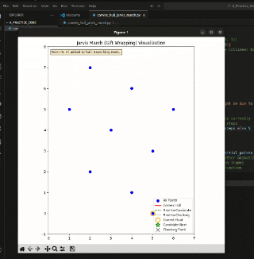

Convex Hull helps to determine the drivable area of a car, extensively used in AV path planning and obstacle avoidance.

Read here: https://brilliant.org/wiki/convex-hull/

### Jarvis March (Gift Wrapping) ALgorithm

